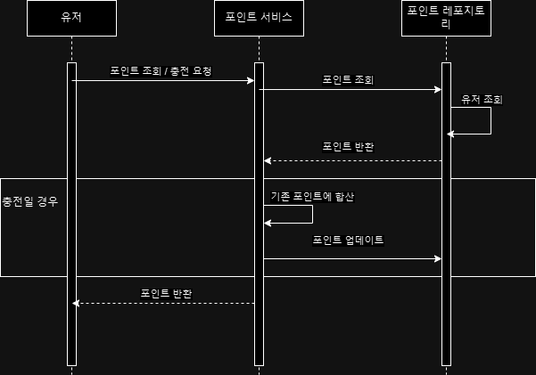
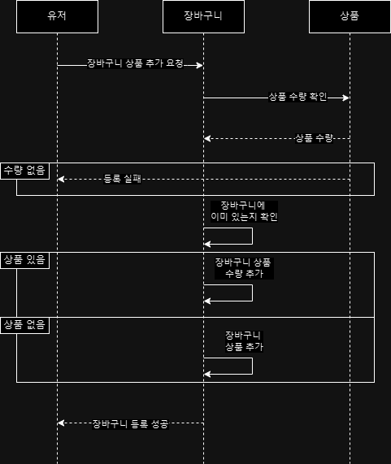

[Step 5](#step-5)  
[Step 6](#step-6)

# step 5
# 마일스톤


https://github.com/users/ljy1348/projects/4/views/1

# 시퀀스 다이어그램
1. 포인트 조회/충전

2. 상품 주문 및 결제

3. 장바구니 등록


# step 6
# ERD


# 기술
아키택처 - 클린 아키택처  
```
domain
├── model
└── repository
application
├── service
└── pacade
inter
├── controller
├── dto
└── adapter
infrastructure
├── config
├── repository
    └─ entity
└── client
```
db orm - jpa  
test - JUnit & AssertJ  
java - openjdk 17  
db - h2  

# API 명세


